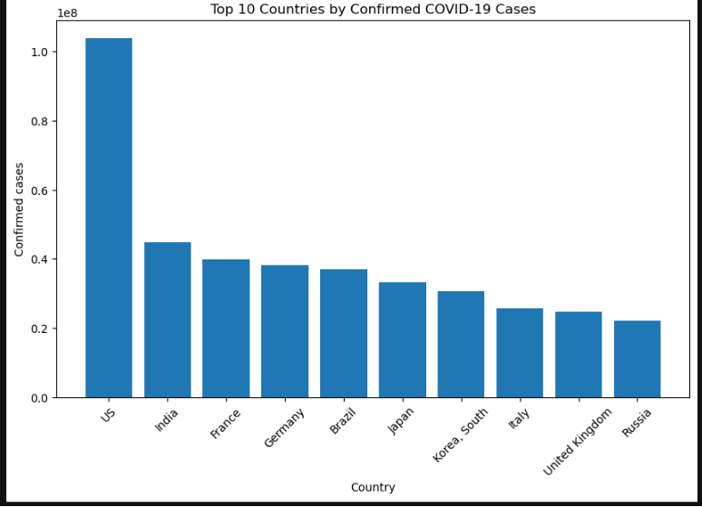
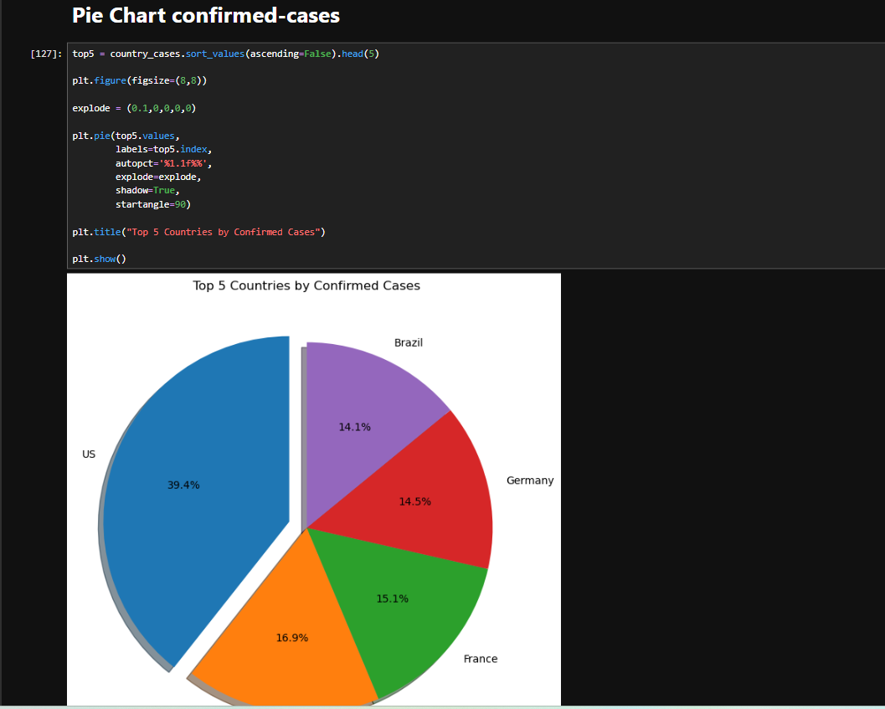
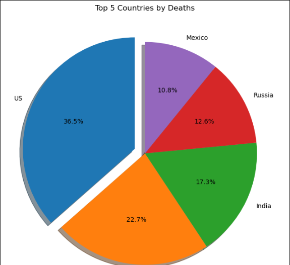

# 🦠 COVID-19 Data Analysis Project

---

# 🌍 About the Project

This project analyzes the global impact of the COVID-19 pandemic using the Johns Hopkins University dataset. The analysis focuses on **Confirmed Cases** and **Death Cases** through data cleaning, exploratory data analysis (EDA), and meaningful visualizations.

The project identifies the most affected countries, compares global trends, and presents insights using multiple chart types and dashboards.

---

# 🎯 Project Objectives

- 📌 Analyze global COVID-19 confirmed cases.
- 📌 Analyze global COVID-19 death cases.
- 📌 Perform Data Cleaning and EDA.
- 📌 Compare the top affected countries.
- 📌 Build informative visualizations.
- 📌 Create a dashboard for better understanding.

---

# 🛠️ Technologies Used

- 🐍 Python
- 🐼 Pandas
- 🔢 NumPy
- 📊 Matplotlib
- 📓 Jupyter Notebook

---

# 📂 Dataset

- Johns Hopkins University COVID-19 Dataset

Datasets Used:

- ✅ Confirmed Cases
- ✅ Death Cases

---

# 📈 Exploratory Data Analysis (EDA)

The following analysis was performed:

- Dataset Overview
- Missing Value Analysis
- Duplicate Value Check
- Data Type Verification
- Country-wise Analysis
- Latest Date Analysis
- Highest & Lowest Cases
- Average Cases
- Maximum & Minimum Cases
- Top 10 Most Affected Countries

---

# 📊 Visualizations

✔️ Vertical Bar Chart

✔️ Horizontal Bar Chart

✔️ Pie Chart

✔️ Line Chart

✔️ Scatter Plot

✔️ Dashboard Visualization

---

# 📷 Project Output

## 📊 Bar Chart

---

## 📊 Horizontal Bar Chart

---

## 🥧 Pie Chart

---

## 🥧 Pie Chart

---

## 📍 Scatter Plot

---

# 📌 Key Findings

- The United States recorded the highest confirmed COVID-19 cases.
- The United States also reported the highest number of deaths.
- India ranked among the countries with the highest confirmed cases.
- Brazil and several other countries experienced significant fatalities.
- Data visualization made it easier to compare countries and identify trends.

---

# 🏆 Conclusion

This project demonstrates how Python can be used to clean, analyze, and visualize real-world datasets. Using Pandas and Matplotlib, meaningful insights were extracted from global COVID-19 confirmed and death data. The visualizations provide a clear understanding of country-wise comparisons and the overall impact of the pandemic.

---

# 📚 References

- Johns Hopkins University COVID-19 Dataset
- Python Documentation
- Pandas Documentation
- Matplotlib Documentation

---

## 🙏 Thank You Very Much

⭐ **If you like this project, don't forget to give it a Star!** ⭐

